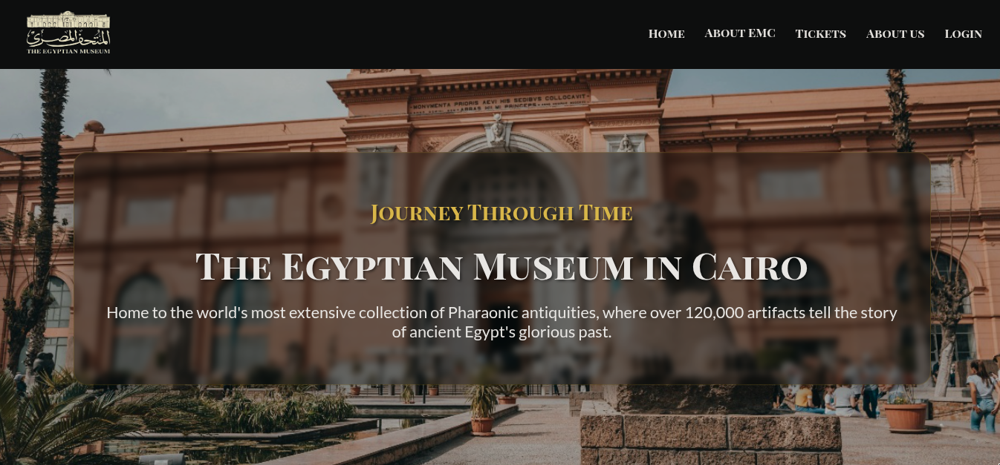
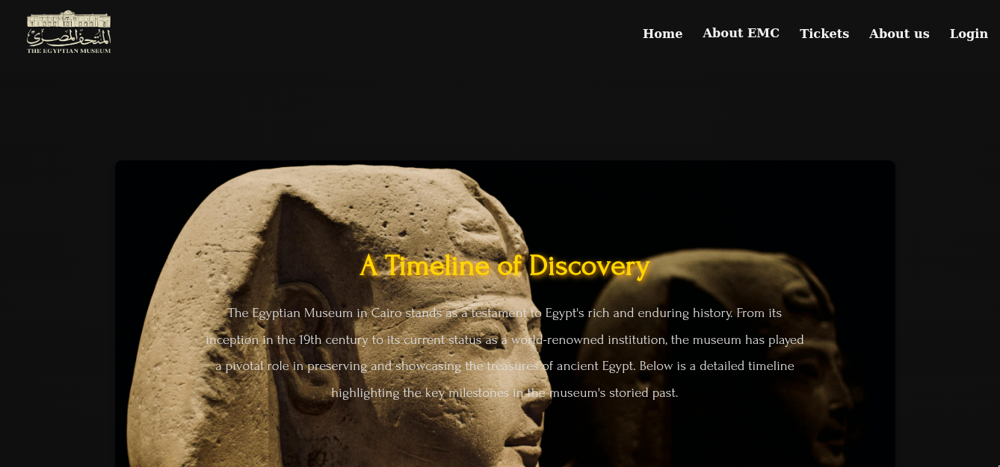
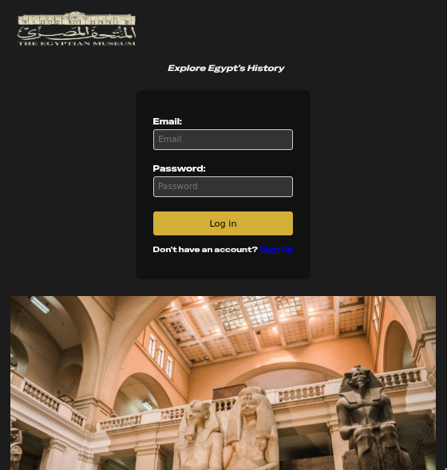
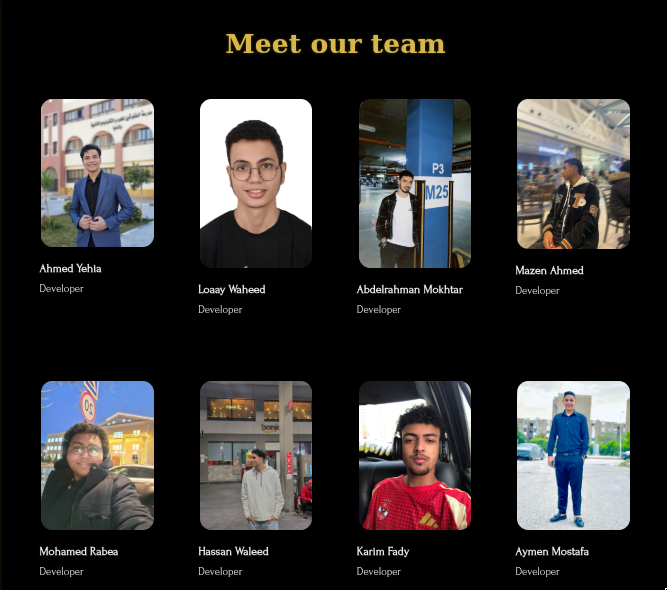

# Egyptian Museum Website

A modern website for the Egyptian Museum, featuring a rich cultural experience with a focus on historical artifacts.
## 🔧 Getting Started

1. Clone the repository
```
git clone git@github.com:Loaay47/IT.git
```
2. Open `index.html` in your browser
3. Explore the different sections and features

## 🌐 Website Preview

### 🏛️ **Elegant Design**  
Dark theme with gold accents, inspired by ancient Egyptian aesthetics.


---
### 🔁 **Interactive Elements**  
Smooth animations and hover effects to enhance user experience.


---

### 💡 **Modern UI/UX**  
Clean and intuitive user interface for easy navigation.



---

## 📁 Project Structure

```
IT-project
├── index.html
├── css
│   ├── about.css
│   ├── events.css
│   ├── history.css
│   ├── login.css
│   ├── main.css
│   ├── style.css
│   └── tickets.css
├── js
│   └── validation.js
├── about.html
├── events.html
├── history.html
├── login.html
├── register.html
├── tickets.html
└── README.md
```

## 🛠️ Technologies Used

- HTML5
- CSS
- JavaScript

## 🤝 Contributing

- Special thanks to all the members and the contributes for making that happen.

